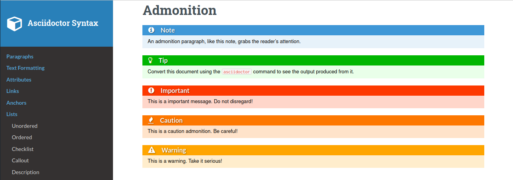

= asciidoctor html readthedocs theme 
:author: Urs Roesch
:email: <github@bun.ch>
:notoc:
:noheader:
:nofooter:

This is an early draft trying to bring a more modern look to the readthedocs
theme included in the asciidoctor gem. 

NOTE: This style is still work in progress and not every element has been
      finalized yet. Refer to the link:samples/article.html[Sample Article]
      file to judge for yourself.

.Screenshot of current admonition.

.Screenshot of current lists.
image::images/asciidoctor-readthedocs-screenshot-lists.png[]

== How to use

=== Copy the css file
Simply copy the `readthedocs.css` file to your projects root folder and run
`asciidoctor` as follows:

[source,shell]
----
asciidoctor -a stylesdir="$(pwd)" -a sytlesheet=readthedocs.css *.adoc
----

=== As a git submodule 

Add the style as git submodule into your project.

[source,shell]
----
git submodule add \
  https://github.com/uroesch/asciidoctor-readthedocs-theme \
  readthedocs
----

The run asciidoctor as shown below.

[source,shell]
----
asciidoctor \
  -a stylesdir="$(pwd)/readthedocs" \
  -a sytlesheet=readthedocs.css \
  *.adoc
----

== Build from scratch

=== Prerequisites
* ruby
* rake
* docker

=== Build

Simply type rake and the command will download a docker container for the
build. And create the `readthedocs.css` file. 

[source,shell]
----
rake
----

=== Create test document

The `syntax.adoc` from the asciidoctor distribution is included use `rake` 
to create the html file. This yields the file `samples/article.html`.

[source,shell]
----
rake test
----

== Todo

* [x] Table of Contents
* [ ] Admonition
** [x] Admonition colors and style.
** [ ] Admonition title overrides.
** [x] Simple one line admonitions.
** [ ] Rich content admonitions.
* [x] Lists
** [x] Unordered Lists
** [x] Ordered Lists
*** [x] Alpha numeric
*** [x] Roman numerals
** [x] Checklists
* [ ] Links
** [x] Link symbol in section titles (anchor)
* [ ] Quotes
* [ ] Tables
** [ ] Table border style
** [ ] Table header style
** [ ] Code inside tables
* [ ] Cleanup
** [ ] Remove duplication.
* [ ] Footer
